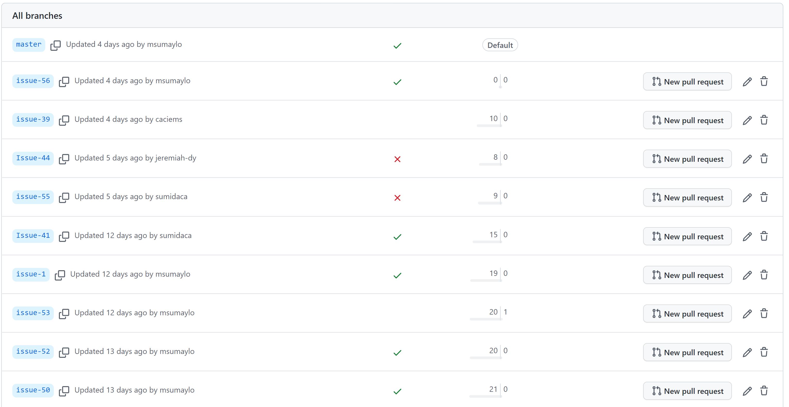
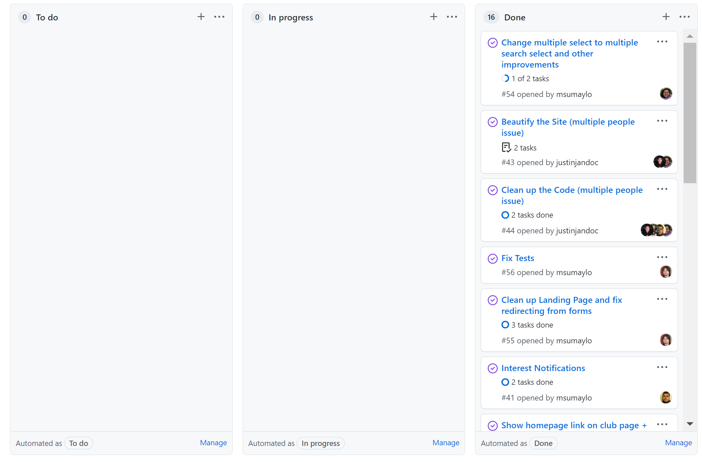

## What Exactly Does It Mean to Practice Software Engineering?

Discussing the process of learning a set of skills with most people will often boil down to whether or not you can do it or not, especially if the person has zero interest or knowledge in the subject. To them, the end result is the most important thing, when in reality there's much more to that. Of course being able to do the skill is still important, it's just that there's a lot more to talk about, such as how it relates to other things. Many times I find that I know how to do something not because I was taught about it, but rather because I'm able to compare it to a similar situation I already know about and I am able to adapt. Software engineering is no different. Most conversations I have about software engineering with others not studying computers or programming boil down to "can you make X", or "can you fix Y". Putting aside the fact that many of things I'm asked about has nothing to actually do with programming, all they see is that I can make something, and not how software engineering concepts have improved my ability to work.

## Keeping Multiple Versions of Work Available

An issue I often run into is not keeping backups of my old work. I will usually keep backups of the final versions of my projects, but I don't often keep in progress versions anywhere. Most of the time, I just edit the project and then save over it, which isn't always a problem, but can set me back if one of the edits breaks something and I can't remember how it was before. Thankfully, I've recently gotten experience using the concept of version control, which is a case of configuration management. Configuration management refers to keeping track of changes made to the configuration of a system, while version control maintains multiple copies of a project system. The advantage of keeping multiple copies of a project is that I can always keep a copy as the working version, then use another copy to work on, and then merge both copies together. And if something breaks when working, I can either use the original version or revert the changes to fix it. GitHub is great for projects that need version control, for solo projects and group projects, where multiple people need to be able to edit files at the same time. Version control can be used for more than programming. If your working on a paper, you may feel like a section isn't working out for you. Instead of deleting the section, you may find it preferable to make a copy and work on that instead, as you may later find that you can make that section work, and if you delete it you would have to rewrite it from scratch. Or for a more physical example, if you want to build a device, you will most likely build a prototype of the device. If you make a second prototype later, you may want to keep the first prototype around to compare with, so that when working on the final design you can use both prototypes as a reference so you can incorporate the best features of each design. Keeping multiple versions of a project is handy, because you never know when something you considered useless might be the key component in solving your problems.

## Splitting Problems Into Sections

Another issue I often run into and have difficulties with is working in an organized manner. It's that issue where you start working on a problem and by the end of the day you're stuck working on five different problems at the same time. People often say that if you get stuck working on a problem, then move on to a different problem and come back to it later. And while that can be a good strategy, the amount of time before you decide that you're stuck can vary from person to person, to the point where you're switching every 5 seconds. Part of that has to do with not knowing which parts to focus on. Some projects need things to be finished in a specific order, and often has parts that should not be done at the same time. Thankfully, that's where Project Management comes in. The type of Project Management depends on the project, but I'm going to focus on Agile Project Management. Agile Project Management is meant for projects where you want to be able to add new, working solutions to a project that are focus and tested within a small time frame. In terms of software development, it's working on small parts of a program like a single function or piece of UI one, or more if it's a group project, at a time, where you test each addition while you're working on it before adding it to the final project once it's finished and tested. This is also known as Issue Driven Project Management, where each part is an issue to be solved before deciding what to work on next. The goal is to focus on a small set of problems before working on new ones. This concept doesn't just apply to software engineering, it could apply to any project. Like say you want to build a device that does five different things. Instead of smashing five different devices together, you should work on each function separately to make sure they work and that you understand how the function, and then slowly work towards a unified design. You're not going to have the best design at first, but the important part is to slowly make your way there, solving problems as they come up. You won't always know every problem from the start, but by working step-by-step you should be able to solve then when they show up.
