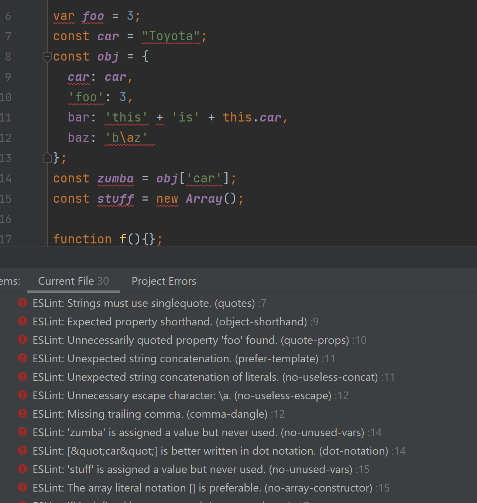
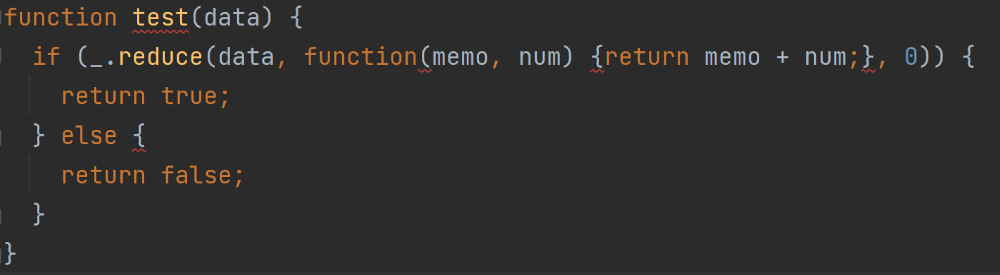
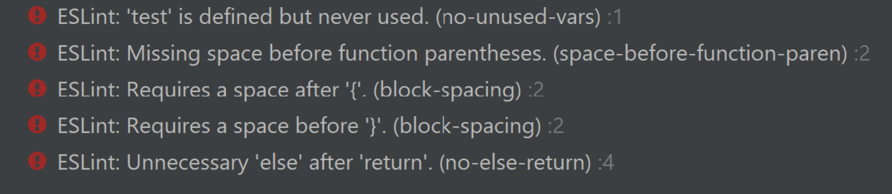

## What Are Coding Standards?

When most people talk about coding, they mostly focus on the function of the code. What some people seem to ignore is what the code looks like. Like essays, code had its own set of standards that helps other people read it. Depending on which set of standards you use, the changes in your code could range from a few extra spaces to completely changing how you write certain statements. Just how important coding standards are seems to change depend on who talks about them. To some it's the most important concept in coding. To others, it's the just a preference that is optional to consider. Not everyone follows coding standards, but it's still an important thing to know, especially if you plan to work in a group setting. However, while coding standards are definitely important, just how important they are is up for debate.

## Experiences with coding standards

Personally, until recently I haven't actively thought about following coding standards. It's not that I didn't think it would be important. On the contrary, I've heard many times that it would be important in the future, especially if I needed someone else to read my code, or even myself. The actual reason I haven't thought about it is because I already try to keep my code consistent. I realize that sounds like I am thinking about coding standards, but to me it's not quite the same. I suppose that I am unconsciously thinking of coding standards, but instead of one that many people follow it's one that I decided for myself from my experiences of coding. Some of it is from looking at other pieces of code, and other parts of it are from trying to reread my code. It's gotten to the point where I try to write each type of statement the same way every time if I can. Since I usually write everything the same way, I don't usually consider how to improve the readability of my code or how it looks compared to others.

## How Hard Can It Be?

  
  

With all that said, the adjustment to ESLint has been rather easy. As I said, I'm already particular about how I write my code and a lot of it is similar to how most people write it, so there wasn't much I had to change. However, that doesn't necessarily mean that there weren't things that threw me off guard when I started. For example, I'm used to attaching else statements if I have a return statement in an if statement. However, when I tried that with ESLint enabled I was given an error. At first I was confused, but then I realized that I technically didn't need to use else statements, since if the else statement has the rest of the code it will run regardless if the else statement is there as long as the if statements fails. I never really considered having the second return statement being by itself, so doing these exercises at least taught me one thing. Looking back at some of my past code, I've made sure to properly space everything so that it is easy to read. I used to think that it was excessive at times, but according to ESLint I haven't been putting enough spaces. Part of that is the small functions I write as part of underscore functions, which I just learned, and part of that are things like needing a blank line at the end of the file. Most of the problems I've had with ESLint are minor things like that, which are easily fixable. Overall, I haven't encountered any major errors that prevents me from getting that green checkmark. Honestly, I think I've spent more time getting ESLint to run in IntelliJ than I have actually fixing ESLint errors.

## So Just How Important Are Coding Standards?

Having said all of that, I suppose that there's only one question that needs answering: are coding standards an important skill to learn when coding. Having thought about it for a week, I don't really have a concrete answer for that question. On one hand, I think implementing coding standards has slightly improved my code. While I was already mindful of certain things, I'm definitely paying more attention to how I format certain bits of code. I've also learned better ways to write certain other parts bits of code. It also reduced the need to look at other bits of code to remember how I write it out, since ESLInt will tell me if I missed a space or something. On the other hand, I don't think it improved the code that much. As I said, I was already mindful of most of the common errors, so my code before I fix the ESLint errors has at most 3 errors, not including any errors detected because I haven't finished writing the code. Of course, this is just how I write code, so it could probably be more helpful to someone else. I still think coding standards are important, I just don't know if I would call it the most important thing to learn.
