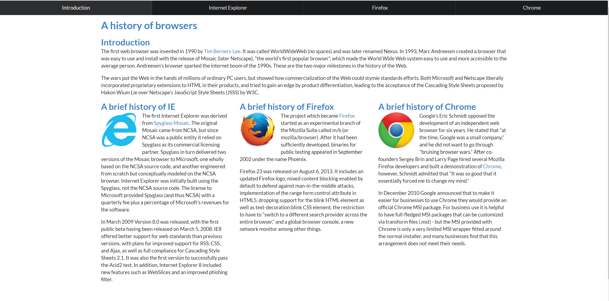
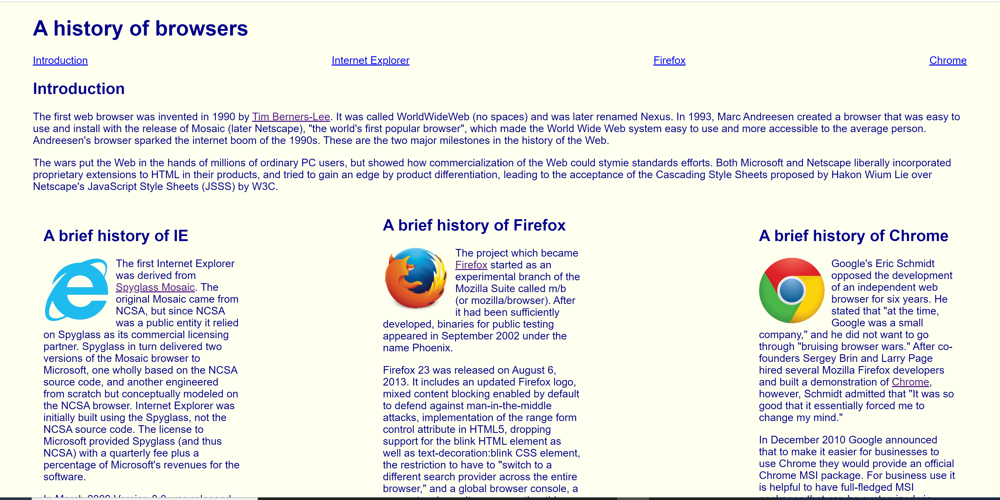
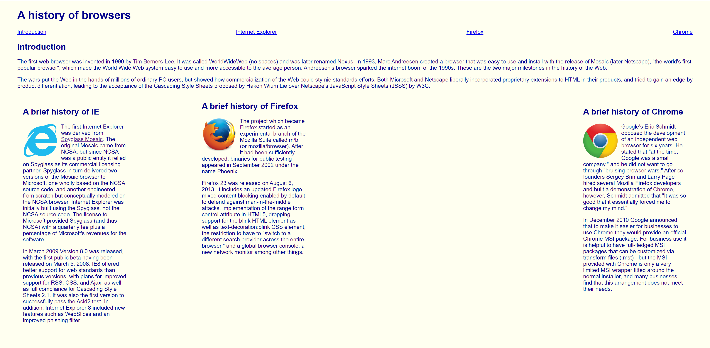

## How Hard is Building a Webpage?

In my experience, when people talk about programming, they often confuse HTML and CSS as programming languages. To be fair, I also thought so until high school, but the general consensus is that it isn't a programming language. That being said, I'd argue that in some ways learning it is as difficult as learning a new programming language. In my personal opinion, the HTML part isn't that difficult, since for the most part it's just placing items on a page. The difficult part is the CSS section. CSS is what changes the style of the page, modifying things such as the font, colors, text-alignment, etc. The difficulty comes in getting everything just right. Most people who create a webpage have a specific image in their mind and will want the page to look as close to that as possible. However, CSS is a bit limited in that regard. While you could technically do anything you want in CSS, you would need to specify every aspect of the element you're trying to change. This can be frustrating, especially if you don't know what everything does. For example, you might try aligning an item and get intimidated when you type align and get around 30 different options. And even if you know what everything does, having to do everything manually can get tiring.

## Introducing Frameworks

Luckily, there is another way to style a page. We can use a framework to style a webpage a bit simpler. Semantic UI has several classes that can be added directly to the HTML that modifies the element they are attached to based on the class specified. These classes can do things from resize elements to create entire menus. Technically you could do all these things with just HTML and CSS, however using Semantic UI makes it simpler. For example, let's walk through making a menu. You could use CSS to accomplish this task, where you could manually set margins, make all the items a list and disable the bullet points, and change the display property to display everything on the same line if you're making a horizontal menu. If you decide to use Semantic UI instead, you can create a div element that has the class "ui menu", then create the menu items in that div and you should have a menu. It's also easy to add more advanced features, such as a dropdown menu. All it needs is the HTML, the dropdown class, and if you don't use the simple class a little JavaScript. With Semantic UI, you could even create a page that looks like that of an actual business, although it obviously takes more work to make it functional.

An example of a recreation of a website. The original is on the left and the recreation is on the right.

  
  

## Do We Still Need CSS?

All that being said, there are still things that are difficult even with Semantic UI. While Semantic UI has all those modifiers to change how an element is affected, some of those are limited. One of those limitations is related to size. Semantic UI has size classes to control how big an element is. The issue with those classes is that they are for set sizes. Sometimes an element needs to be a certain size to fit with other elements, such as an image fitting in a menu with text. If your image is too small with medium and too big with large, there is no in-between size, so you would need to use CSS to manually set the size. The site I made had a few issues with sizing, where either elements wouldn't match up or the default sizes weren't big enough for what I needed, so I had to modify them with CSS. Another thing that's limited about the classes is the colors. Semantic UI has 12 colors that can be called. If you need a color that isn't included with Semantic, you'll need to use CSS. Speaking of colors, another problem is the text style. If you don't care about the font or the color of the text, then this won't be a problem for you. However, every element uses the same font, and certain elements have specific colors. For example, regular text and most items are black by default, but an element with an a tag is blue by default. It is possible to change it, but the order styles are applied to an element can mean that you need to be careful how you apply it. This can lead to frustration if the CSS selector isn't specific enough and the page ignores your changes. And even if it does work, you'll realize that you had to use CSS to change the color, making you wonder why you bothered to learn Semantic in the first place.

## Is it Still Worth Learning?

With all those issues we ran into, we now need to consider one thing: Is it worth learning Semantic UI despite of all the issues. The answer may vary for different people, but I believe that the positives outweigh the negatives. As I've stated before, it's not a good idea to stop using CSS completely, but it's also not a good idea to rely on it completely. Semantic UI has its limitations in what it can do, to the point that the example above uses a decently sized stylesheet. But that stylesheet combined with Semantic is still preferable to having an even longer stylesheet that might have taken even longer to create. And the issue with the order of styles is easy to get around if you know what you're doing. I personally find the using Semantic UI makes it easier overall to make nicer looking webpages, and I recommend that people at least try it for a bit. Just look at the difference between a page built with Semantic UI and a page built with just CSS. 

  
  
  

