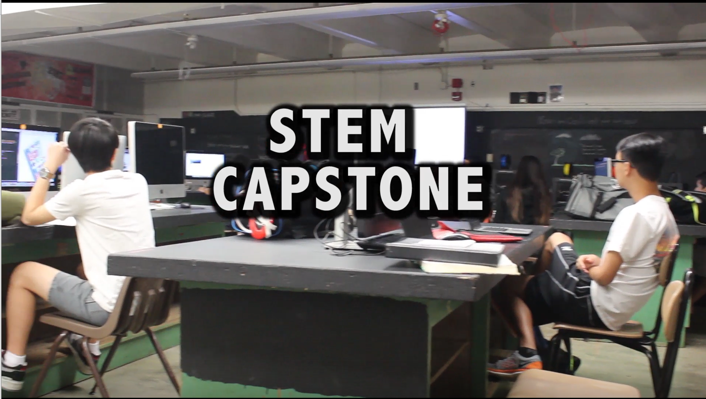
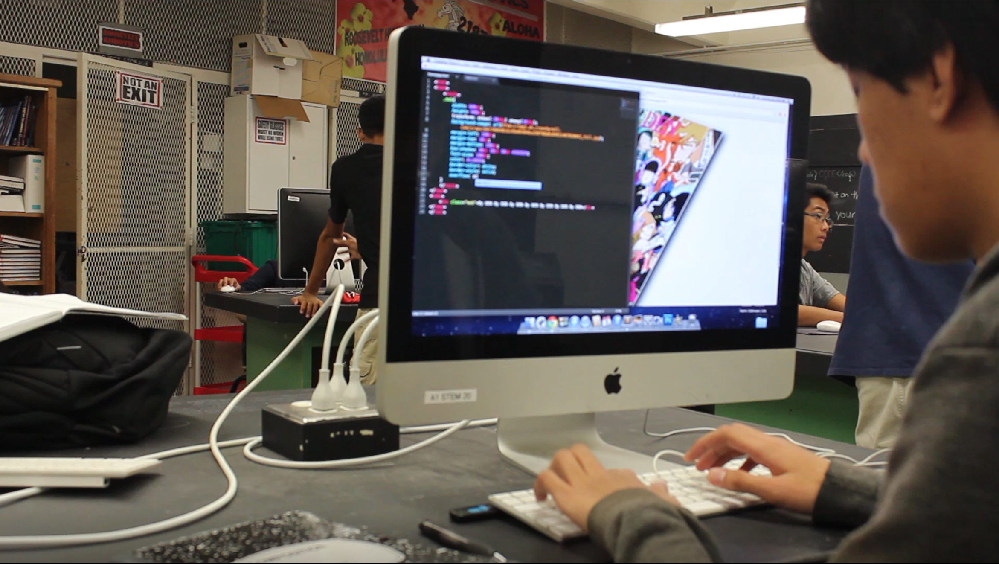
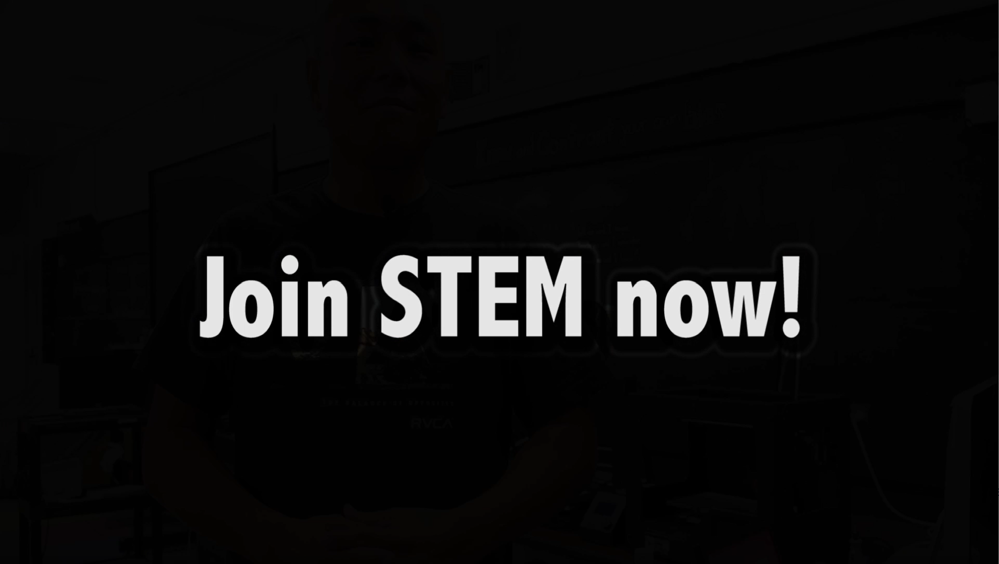

  
  
  

## What This Project Is

During high school, one of my classes had an assignment to film a promotional video for a class to air on the morning announcements to give students ideas on what classes to sign up for. My choice was to film the STEM class I was in, since I thought that more people would find it interesting if they knew what it was like. The promotional video gave students a glimpse of what we did in the class, while listening to the words of STEM students and their teacher.

## What I Did

This project was done with one of my classmates. Since he wasn't taking that class, I was the one in charge of organizing the shoot. I wrote the storyboard for the video, I came up with interview questions to ask people in the class, I gave the interviews to the participants, and I gave some assistance with the editing, mostly giving advice on a few sections. Since I was the one taking the class, I also had to make sure we had permission to film the class.

## What I learned

While I didn't have a lot to do with the filming of the video, I was involved with a lot of it's production. This gave me a chance to learn some skills I wouldn't normally use. My usual projects don't usually involve interviews, so I got to learn the process of giving an interview. Additionally, I had to plan out everything in advance. The video had to be filmed during my digital media class, so I had to ask my STEM teacher ahead of time if I could come in during a different class and coordinate a time when I wouldn't be interrupting it but still get a chance to film them working. This allowed me to work on my organizational skills. I also let me think about how to inform people who may or may not be interested in a subject.
