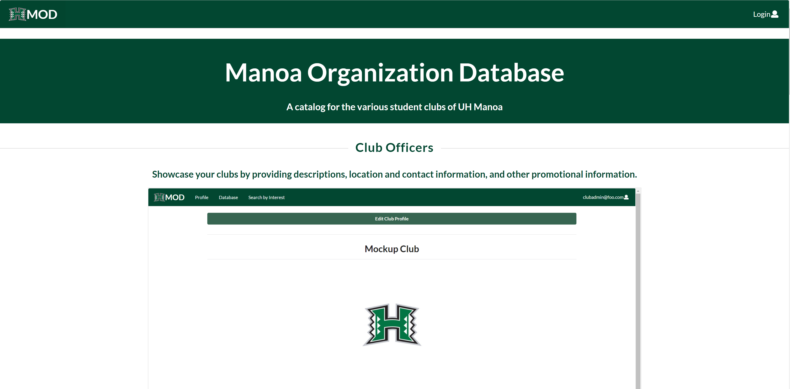
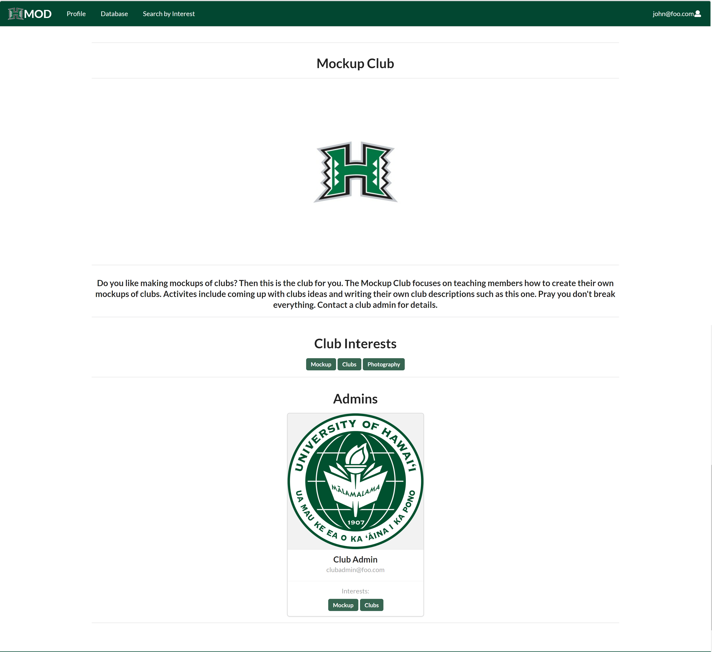
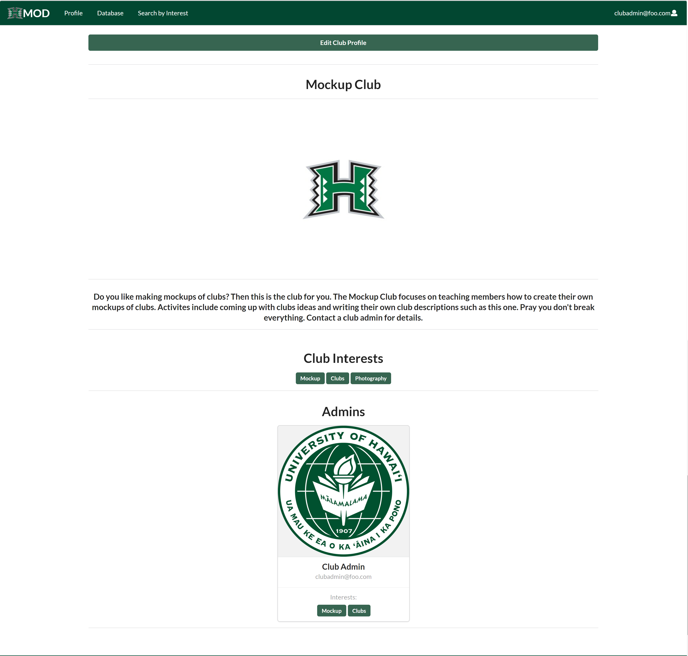
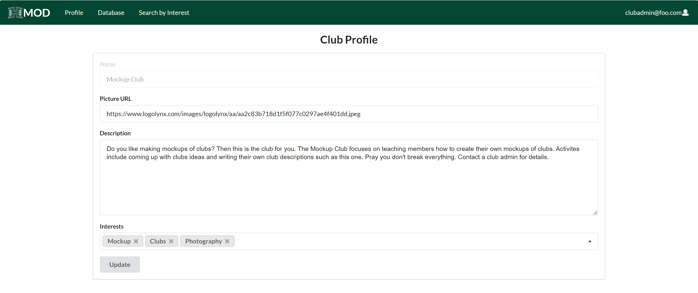
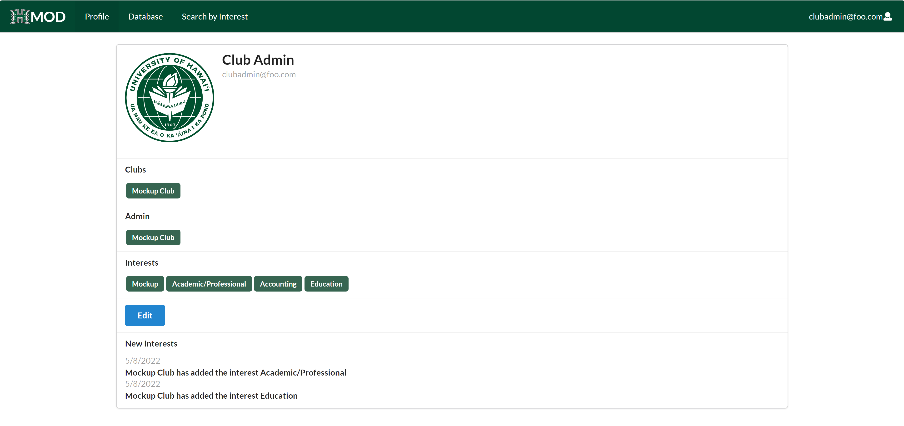

## What Is The Manoa Organization Database?

The Manoa Organization Database, or MOD, is a web application that serves as a database for the various clubs associated with UH Manoa developed for a group project in ICS 314. The app allows UH students to register for an account, scroll through a list of clubs to join, with descriptions and contact info for club officers should they be interested, and if they are a club officer they can edit the club page for any clubs that the are registered as a club officer for.

## What Parts Did I Do?

The main areas I focused on were the pages with club officer functionality. This included making two versions of a club page, one for regular users and another for club officers, adding the edit club page, implementing a mongo collection that keeps track of club officers, and modifying the profile page to add a section for clubs the user has club officer status for. Additionally, I implemented two collections, one for keeping track of which interests a club has and one to keep track of when a club adds a new interest, and I added a section to the user profile that notifies a user when a club adds an interest that matches an interest on their profile.

  
  
  
  

Additionally, I also wrote some sections of the project webpage, such as the walkthrough.

## What Skills Did I Develop?

This project focused on a number of skills I either recently learned or don't use very often. The main thing I got from this project is working with a team to develop a project. Needing to communicate on who's doing what, deadlines, and any issues members run into was a learning experience, since I'm more used to working at my own pace and not needing to worry about if someone has already started on an issue, explaining what part I'm working on, or if I'm working at a reasonable pace compared to the rest of the team. This project has also allowed my to get experience with Meteor, MongoDB, and Github. Working on making and deploying apps was very interesting, and learning how to manipulate databases was a fun challenge.

The project repository can be found [here](https://manoa-organization-database.github.io/), the project page can be found [here](https://github.com/manoa-organization-database/manoa-organization-database), and the app itself can be found [here](https://manoa-organization-database.xyz/).
