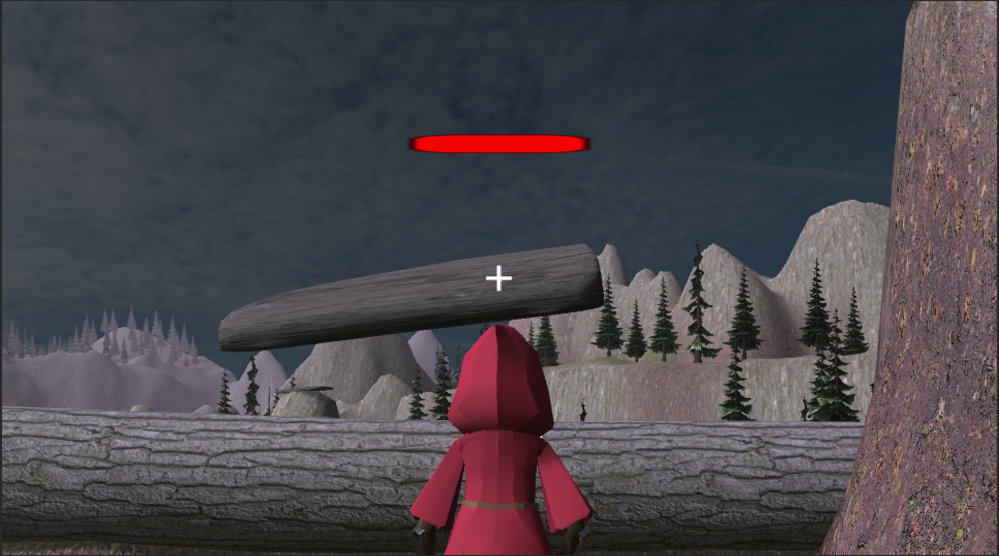

## What Is Kinetic Mountain

Kinetic Mountain is a game developed as a group project for ICS 485. You play as a wizard as you use telekinesis to move objects to make platforms and defend yourself against enemies.

## Which Part of The Game Did I Develop?

This project had three team members. I served as the main programmer, developing the main functionality of the game. Specifically, I made the main menu and control menu, implemented controls for the player character, camera, and telekinesis, added the sound effects, implemented the art assets my teammate made into the actual game, and did some general bug fixing and quality of life improvements. Additionally, I also made most of the project page.

Here is a demo of the game in it's current state
<iframe allowfullscreen="allowfullscreen" src="https://drive.google.com/file/d/1QdraQ_bxaoOvVH5qHWqnxz7x7RQbzaF2/preview" width="848" height="480"></iframe>

## What Did I learn From This Project?

This project focused on a couple of areas, both in terms of working in a group and actual development. On the working in a group side of things, I had to learn how to manage my time efficiently, constantly switching between this project, another project, and other class work, meaning I needed to discuss with the group when I was free to work or discuss things. On the development side of things, I learned how to use unity and C#, which gave me experience in my desired career path. I also needed to adapt to various problems that came up in development, whether it was a coding issue or a Unity issue.

The project page can be found [here](https://team-wizard.github.io/), and the game can be played [here](https://sumidaca.itch.io/kinetic-mountain).
